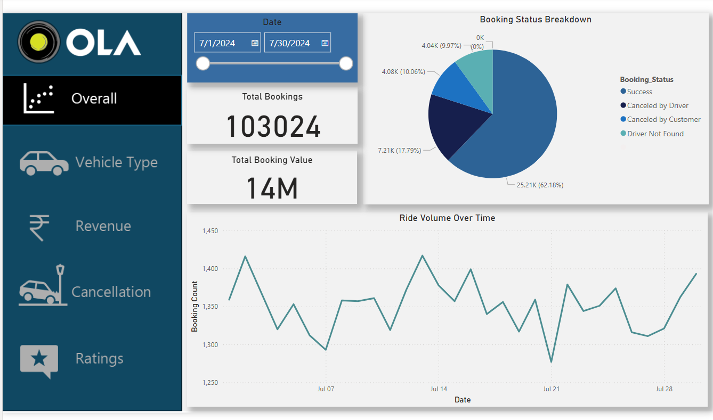

# Ola Data Analytics - End-to-End Project

## Project Overview
This comprehensive analytics project examines ride-hailing operations using a multi-tool approach combining SQL, Excel, and Power BI. The analysis focuses on understanding booking patterns, customer behavior, and operational efficiency to drive data-informed business decisions.

**Tools & Technologies:**
- **SQL**: Database querying and data extraction
- **Excel**: Data cleaning, transformation, and preprocessing
- **Power BI**: Interactive dashboards and visual analytics

## Project Objectives
The analysis aims to uncover actionable insights across multiple dimensions:
- Identify booking trends and peak demand periods
- Analyze cancellation patterns and root causes
- Evaluate customer satisfaction and service quality
- Optimize revenue streams and payment preferences
- Understand vehicle type performance metrics

## Dataset Overview
The project utilizes a comprehensive dataset containing one month of ride-hailing operations from Bengaluru, encompassing approximately 40,000 booking records.

**Key Data Fields:**
- Temporal data (Date, Time)
- Booking identifiers and status
- Customer and vehicle information
- Location details (Pickup, Drop)
- Turnaround time metrics (V_TAT, C_TAT)
- Cancellation tracking (Customer/Driver)
- Financial data (Booking Value, Payment Method)
- Performance metrics (Ride Distance, Ratings)
- Incomplete ride tracking and reasons

## SQL Analysis - Business Questions

### Core Queries Developed:
1. **Successful Booking Analysis**: Extract all completed rides to understand conversion rates
2. **Vehicle Performance**: Calculate average ride distance segmented by vehicle category
3. **Customer Cancellations**: Quantify cancellation volumes initiated by riders
4. **Top Customer Identification**: Rank customers by booking frequency for loyalty insights
5. **Driver Cancellation Analysis**: Categorize driver-side cancellations by reason (personal vs. vehicle issues)
6. **Rating Benchmarks**: Determine rating ranges for Prime Sedan category
7. **Payment Preference**: Filter transactions by UPI payment method
8. **Customer Satisfaction**: Aggregate ratings across vehicle types
9. **Revenue Calculation**: Sum total booking value for successful completions
10. **Incomplete Ride Tracking**: Document all unfinished rides with associated reasons

## Power BI Dashboard Components

### Visual Analytics Delivered:

**1. Overall Performance View**
- Ride volume trends over time (time-series analysis)
- Booking status distribution (success vs. cancellation breakdown)

**2. Vehicle Type Analysis**
- Top 5 vehicle categories by cumulative distance
- Average customer satisfaction scores per vehicle type

**3. Revenue Intelligence**
- Payment method revenue comparison
- Top 5 high-value customers leaderboard
- Daily ride distance distribution patterns

**4. Cancellation Insights**
- Customer-initiated cancellation reasons
- Driver-initiated cancellation reasons

**5. Rating Analysis**
- Driver rating distribution and patterns
- Customer rating distribution and patterns
- Comparative analysis: Customer vs. Driver ratings correlation

## Dashboard Preview


## Key Findings & Impact

### Performance Metrics:
- **Success Rate**: Achieved 62% booking completion rate
- **Customer Cancellations**: Maintained below 7% threshold
- **Driver Cancellations**: Contained under 18% of total bookings
- **Incomplete Rides**: Less than 6% of all bookings

### Critical Insights:

**Operational Excellence:**
- Identified AC malfunction and driver location drift as primary 4-wheeler cancellation drivers
- Peak demand periods correlate with weekends and local event schedules
- Average ride distances vary significantly across vehicle categories, informing fleet allocation

**Revenue Optimization:**
- 70% of transactions fall under ₹500 value bracket
- 28% represent premium bookings above ₹500
- Payment method preferences reveal opportunities for digital payment incentives

**Quality Metrics:**
- Vehicle type performance ratings enable targeted service improvements
- Customer-driver rating correlation analysis highlights service excellence patterns
- Systematic tracking of incomplete rides enables proactive issue resolution

### Business Recommendations:
- Implement preventive maintenance protocols to reduce vehicle-related cancellations
- Optimize driver allocation algorithms to minimize pickup location discrepancies
- Develop targeted strategies for peak demand periods
- Create loyalty programs for high-frequency booking customers
- Enhance digital payment adoption through incentive structures

## Project Structure
```
├── Data/
│   └── ola-data-file.xlsx
├── SQL/
│   ├── SQL_queries.sql
│   └── Create_Database_Ola.sql
├── Reports/
│   ├── Overall_Report.pdf
│   ├── Vehicle_Type_Report.pdf
│   ├── Revenue_Report.pdf
│   ├── Cancellation_Report.pdf
│   └── Rating_Report.pdf
└── README.md
```

## Conclusion
This end-to-end analytics project demonstrates the power of integrated data analysis across SQL, Excel, and Power BI platforms. By transforming raw operational data into actionable insights, the project enables data-driven decision-making for improved customer satisfaction, operational efficiency, and revenue optimization in the ride-hailing industry.

---

*Analysis Period: 1 Month | Location: Bengaluru | Records Analyzed: ~40,000*